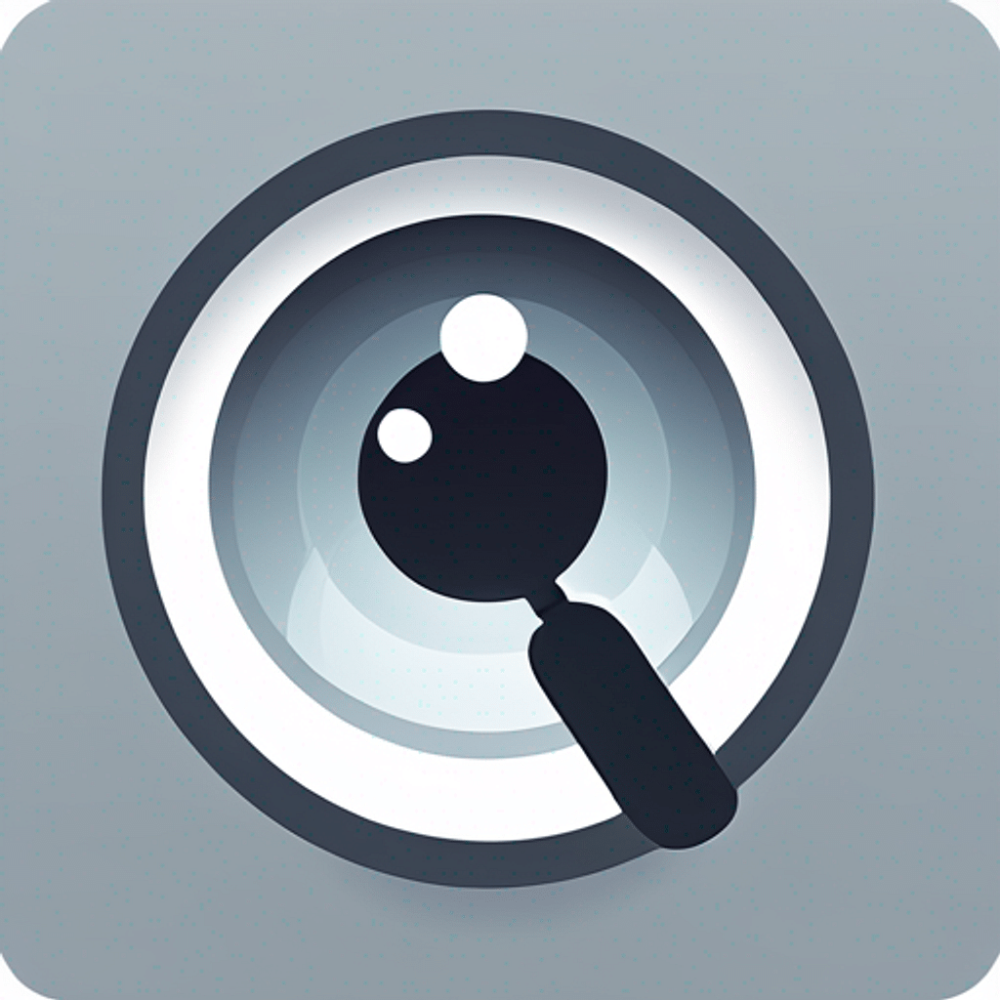

# CEE 342 - *Ask Me Anything*

 
> **Ask Me Anything** is a VisionOS app that queries the environment using pictures. 

[![Swift Version][swift-image]][swift-url]
[![GPT Version][gpt-image]][gpt-url]

## Screenshot

## Features

The following functionality is completed:

- [x] User can launch a "camera view" to take pictures using Siri or the physical crown button.
- [x] User can ask a question and see the live transcription
- [x] User can receive a response from GPT via text
- [x] User can reset/cancel during or after the task
- [x] User can play and pause audio
- [x] User can listen to the response

Additional features are in progress

- [x] Show a description of what the user type actually means for the task (TTS)
- [ ] <s>Improve the interface in the `CameraView` - position and style</s>
- [x] User receives alert when launching camera informing about limitations
- [x] Improve navigation interface using TabView
- [ ] Add accessibility support for VoiceOver annotations
- [ ] Style the status text or animate it for better usability
- [ ] Limit audio recording time to prevent poor GPT response

Stretch goals:

- [ ] User can place text or audio response in the real world using anchors
- [ ] Image/question/response is saved in database for future review
- [ ] User can gesture towards items in the physical space and receive information (semantic map, etc)

Nielsen's Usability Heuristics
- [x] Visibility of System Status
  * Live transcription, status during GPT response
- [x] Match Between the System and the Real World
  * icons like photos, microphone
- [x] User Control and Freedom
  * select user type, ask any question
- [ ] Consistency and Standards
- [x] Error Prevention
  * default values in place
- [x] Recognition Rather than Recall
  * preview selected image, transcript of question
- [ ] Flexibility and Efficiency of Use
- [ ] Aesthetic and Minimalist Design
- [ ] Help Users Recognize, Diagnose, and Recover from Errors
  * lots of error printing, only some error handling
- [ ] Help and Documentation

## Demo

## References

- [Speech to Text](https://developer.apple.com/tutorials/app-dev-training/transcribing-speech-to-text) - Record and transcribe audio
- [PhotosPicker](https://www.hackingwithswift.com/quick-start/swiftui/how-to-let-users-select-pictures-using-photospicker) - Selecting and displaying image
- [TabView](https://www.hackingwithswift.com/books/ios-swiftui/creating-tabs-with-tabview-and-tabitem) - Setting up TabView
- [App Icon](https://www.iconikai.com/generate-icon) - AI generated app icon
- [README Template](https://github.com/awesome-labs/swift-readme-template)
- [Martin Bucher](https://github.com/mnbucher) - coding help
  
## License
[swift-image]:https://img.shields.io/badge/Swift-FA7343?style=for-the-badge&logo=swift&logoColor=white
[swift-url]: https://swift.org/
[gpt-image]:https://img.shields.io/badge/ChatGPT-74aa9c?style=for-the-badge&logo=openai&logoColor=white
[gpt-url]:https://chatgpt.com
